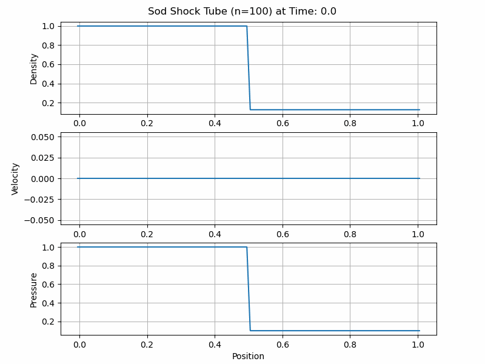

# CUDA-CompressibleFlow
## Introduction
This software is to simulate one-dimensional compressible fluid dynamics.
## Requirements
- OS: Windows-x64 | Linux-x64 | macOS-arm64
- Graphics: Nvidia GPU (If you want to switch on CUDA-acceleration.)
- Programming skills: Python and NumPy
## Software features
- Just-in-time compilation
- Console APP
- Binary file I/O
- CPU Parallel computing
- GPU Parallel computing (only for Linux-x64 or Windows Subsystem for Linux 2 (WSL2) on Windows-x64)
## Numerical algorithms
- Finite volume method
- Piecewise constant reconstruction
- HLLE solver
- Euler method
## User guide
### 1. Writing initial conditions into binary files
The most difficult thing for users is to write a initial state of fluid into a binary file. However, don't worry, it's not too hard if you ara able to write Python and NumPy. 
Although many languages are able to read/write binary files, Python is easiest such that I will teach you how to write with Python.

Sod shock tube is a classical test problem for 1D compressible flow so let's learn how to write the initial binary file through this pedagogical example.
I had put a completed Python code SodShockTube.py in folder named examples in this repository, please refer it.

First, you need to set five parameters:
- `CFL`: This is the Courant–Friedrichs–Lewy number which is lower than 1.0. The lower the CFL is, the more stable numerically the simulation is.
- `evolutionTime`: The evolution time means a time interval the fluid flows from start in the simuation. For initial condition, we set 0.0 usually.
- `n`: n is the number of cells. The space domain is divided by these cells and each cell has a coordinate and physical variables. The more the the number of cells, the more accurate numerically the simulation is.
- `L`: The length of the space domain.
- `gamma`: gamma is heat capacity ratio of fluid. For ideal gas, gamma is 5.0/3.0 and 1.4 for standard Sod shock tube test.

You need to save this five numbers as a NumPy array, then output a binary file. Please note that their type is double, `numpy.double()` can covert a numeber into a double. About the order of parameters in a NumPy array, please follow the code: 
```
parameters = np.array([np.double(CFL), np.double(evolutionTime), np.double(n), np.double(L), np.double(gamma)])
``` 
Then, you output a binary file saving parameters and the file name is the number of step plus BinaryParameters.bin. We set the number of initial step as 0 usually:
```
parameters.tofile(os.path.join(path, "0BinaryParameters.bin"))
```
`path` is the binary files output path. In this software, for not WSL2 OS, binary files are saved in the folder named data placed in the path includeing exe file and, for WSL2, in the desktop.
Because of storage limit of WSL2, saving binary files in desktop is more convenient.

Numerical algorithms adopted in this software requires one ghost cell at each endpoint so the total number of cells is `N = n + 2` but the space domain excludes ghost cell such that the cell length is `dL = L/n`.
According to this ghost cell setting, you write down coordinates of each cells with NumPy: `x = numpy.linspace(-dL/2, L+dL/2, N)`.

Second, you need to set three 1D field variables with N data:
```
density = np.zeros(N)
velocity = np.zeros(N)
pressure = np.zeros(N)
```
Now, we want to simulate Sod shock tube so set initial conditions for Sod shock tube in the domain $x\in[0, 1]$ (You should extend domain in order to include ghost cells so you see that I type `numpy.linspace(-dL/2, L+dL/2, N)` rather than  `numpy.linspace(0, L, n)` in my Python code.):

$$
\begin{align*} 
&\rho(x)=\begin{cases}
1.0, &x<0.5\\
0.125, &x\ge0.5\\
\end{cases}\\
&v(x)=0\\
&p(x)=\begin{cases}
1.0, &x<0.5\\
0.1, &x\ge0.5\\
\end{cases}
\end{align*}
$$

We fill above values into three fields with `numpy.where()`. Please note that the length of `x` must equal to of three field arrays:
```
density = np.where(x<0.5, 1.0, 0.125)
velocity = np.where(x<0.5, 0.0, 0.0)
pressure = np.where(x<0.5, 1.0, 0.1)
```
Before output field varables data, you need to append them into a flattened array in the order of density, velocity and pressure due to the data structure of the binary file:
```
flattenPrimitive = np.concatenate([np.double(density), np.double(velocity), np.double(pressure)])
```
Then, you output a binary file saving variables and the file name is the number of step plus BinaryVariables.bin. We set the number of initial step as 0 usually. The `path` is the same as BinaryParameters.bin:
```
flattenPrimitive.tofile(os.path.join(path, "0BinaryVariables.bin"))
```
Now, you have initial binary files 0BinaryParameters.bin and 0BinaryVariables.bin in proper path and next we activate exe file to start the simulation.
### 2. Running a simulation
If you don't have exe file yet. Please go to Releases page in this repository and download a zip file corresponding to your OS. The exe file name is CompressibleFlow1D, please activate it.
By the way, for Linux-x64 version, you need to execute command line `chomd +x CompressibleFlow1D` at first time. 

After starting software, You see `Please input your initial step:` first, please key the number of the initail step you set. 
For example, we output initial binary files as 0BinaryParameters.bin and 0BinaryVariables.bin and the number 0 included in file name is our intial step so you key 0 and then press enter.

Then, you see `Please input the value of the end time for your simulation:`. For standard Sod shock tube test, you key 0.2 and then press enter but also key other values what you want of course as long as the value of end time is larger than of initial evolution time.

Next, if you execute Linux-x64 version on Linux or WSL2 and also install Nvidia GPU in your computer, the instruction will show `Do you want parallel computing with CUDA? Please press Y/y if you want or any other key if not.`, please follow this instruction to switch on or off GPU parallel computing (However, 1D compressible fluid dynamics isn't a high arithmetic intensity model actually so that there is no outstanding speedup for GPU in most cases. Please refer the section [Performance](#performance)).

You see `Congratulations! All initial settings are already set up successfully. Your simulation starts now!` if all settings are set up successfully and then the software simulates your model until reaching end time you key. 

Finally, when you see `Simulation finished! Please press any key to exit!`, you press any key to close software, then you will find many binary files with different time steps in data folder. 
Each file includes parameters and physics field variables at different time step so you can read these files to do data analysis. 

One more thing you need to know is the maximum steps for GPU parallel computing is 100. Thus, if evolution time didn't reach your end time within 100 steps, you need to restart your simulation from the last output step. 
The purpose of this feature is to reduce data transfer times between CPU and GPU. Please refer the section 4. Restarting a simulaiton to know how to restart.
### 3. Reading and analyzing results
After a simulation, you can read each binary data with `numpy.fromfile()`. For example, in data folder you have 50BinaryParameters.bin and 50BinaryVariables.bin and want to analyze fluid state at step 50. Reading them in your Python script is:
```
parameters = np.fromfile(/your_data_folder_path/50BinaryParameters.bin)
CFL = parameters[0]
evolutionTime = parameters[1]
n = np.int32(parameters[2]) #n must be converted to an integer.
L = parameters[3]
gamma = parameters[4]

flattenVariables = np.fromfile(/your_data_folder_path/50BinaryVariables.bin)
variables = flattenVariables.reshape((3, -1))
rho = variables[0]
v = variables[1]
p = variables[2]
```
Now, you have parameters and variables at the step 50. You can do furthermore analysis such as data visualization in your Python script.

I wrote a function `DrawData()` in my Python code SodShockTube.py being able to draw density, velocity and pressure fields at each step from all binary files in data folder, please refer my Python code.

Below gif is visualization of three 1D field variables in Sod shock tube test.

### 4. Restarting a simulaiton
It's very easy to restart a smulation if you have binary files from last turn. You just reactivate exe file again, key last step or other step from which you want to restart and then key another value of end time.
However, please note that if you close software or cease simulation abnormally in last turn, you should restart from the second to last step rather than the last because the data may not completed in the last step output.
## Performance
Finally, we take the Sod shock tube as a example to talk about time cost and GPU speedup in this software. Unfortunately, GPU speedup in the 1D compressible fluid simulations seems not good. 
I attribute this disappointed result to low arithmetic intensity. In other words, compared arithmetic computing, data transfer and output files dominate time cost. 

In order to show low arithmetic intensity. I designed two definition of speedup in my software:
1. (time of CPU parallel computing + Binary files output)/(time of GPU parallel computing + data transfer between CPU and GPU + Binary files output)
2. (time of CPU parallel computing)/(time of GPU parallel computing + data transfer between CPU and GPU)
